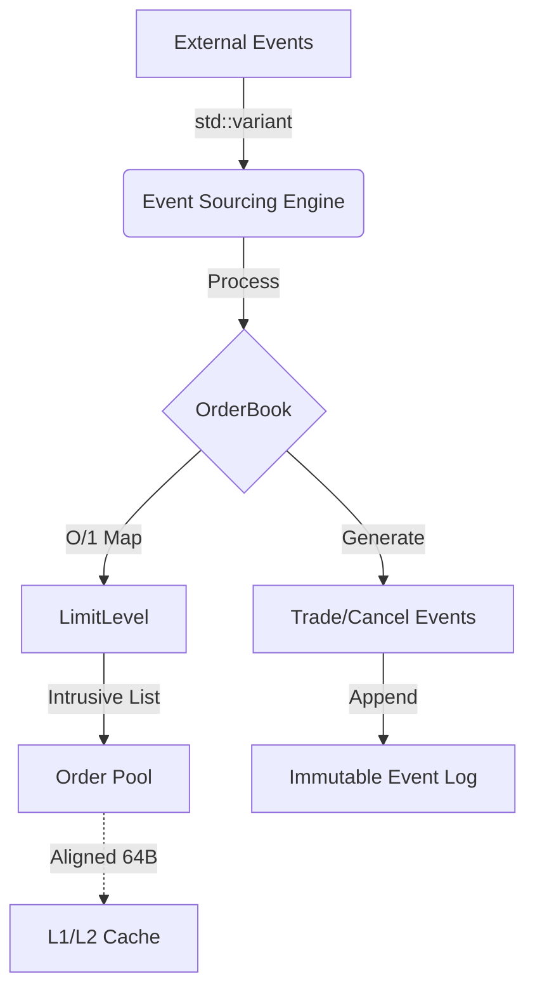

# Deterministic Low-Latency Matching Engine

**Note: This is the raw C++ core engine. I am currently building a Python-wrapped version for easier backtesting. Join the waitlist here:** https://forms.gle/BrEMDX3qCx5JfgFz9


> **A production-grade, single-threaded Limit Order Book (LOB) designed for High-Frequency Trading (HFT).**
> Features zero runtime allocation, cache-aligned memory layout, and deterministic event sourcing.

---

## 📖 Overview

This project implements a **deterministic matching engine** optimized for microsecond-level simulations and backtesting. Unlike generic implementations, it adopts a **Data-Oriented Design (DOD)** approach to minimize instruction cache misses and branch mispredictions.

**Core Philosophy:**

- **Zero Allocation**: No `new`/`malloc` on the hot path. All memory is pre-allocated in contiguous pools.
- **Cache Locality**: Critical data structures are aligned to 64-byte cache lines to prevent false sharing and maximize L1/L2 hits.
- **Determinism**: The engine state is a pure function of the input event stream, allowing for bit-exact replay and debugging.

---

## ⚡ Performance Benchmarks

Benchmarks were conducted on a consumer workstation (WSL2) under standard load.

- **Environment**:

  Intel Core i9-13980HX (13th Gen)
  WSL2 (Hyper-V)
  GCC 13.3
  `-O3 -march=native`

- **Methodology**: 1,000,000 orders processed in-memory (Hot Path).

| Metric                | Measurement              | Description                                          |
| :-------------------- | :----------------------- | :--------------------------------------------------- |
| **Throughput (Mix)**  | **16.4 Million ops/sec** | Realistic Mix (50% Add / 50% Cancel/Trade)           |
| **Throughput (Rest)** | **50.0 Million ops/sec** | Limit Order Placement (Liquidity Building)           |
| **Latency (P50)**     | **30 ns**                | Median processing time per order                     |
| **Latency (P99)**     | **~800 ns**              | Tail latency (subject to OS interrupts/WSL2 noise)   |
| **Cancel Latency**    | **15 ns**                | **O(1)** complexity via Intrusive Doubly-Linked List |

> **Note**: In a bare-metal Linux environment with CPU isolation (isolcpus), tail latency (P99) is expected to be significantly lower (<200ns).

---

## 🏗️ Technical Architecture

### System Architecture



### 1. Memory Layout (Hot Path)

The engine abandons standard STL containers for the order storage to ensure pointer stability and locality.

- **Object Pool**: Orders are stored in a pre-allocated `std::vector<Order>`. Pointers are stable 64-bit addresses within this block.
- **Intrusive List**: Instead of `std::list` or `std::vector`, orders contain `prev` and `next` pointers. This allows **O(1) removal** from the book without memory deallocation or list traversal.
- **Cache Alignment**:
  ```cpp
  struct Order {
      // ... fields ...
      Order* next;
      Order* prev;
  } __attribute__((aligned(64))); // Fits exactly in one Cache Line
  ```

### 2. Event Sourcing

State mutations are driven strictly by a stream of `Event` variants (`std::variant`).

- **No Virtual Functions**: Polymorphism is handled via `std::visit`, enabling compiler inlining and avoiding vtable lookups.
- **Replay Engine**: The system can reload a CSV log and reconstruct the exact state of the Order Book at any timestamp.

### 3. Type Safety

- **Strong Typing**: `Price`, `Quantity`, and `OrderId` are distinct types (via template wrappers) to prevent semantic errors (e.g., adding a Price to a Quantity).
- **Fixed-Point Arithmetic**: Prices are stored as `int64_t` (scaled by 10,000) to avoid floating-point inaccuracies.

---

## 🚀 Getting Started

### Prerequisites

- C++17 compliant compiler (GCC/Clang/MSVC)
- CMake 3.14+

### Build & Run

The project includes a unified test script that handles build configuration and execution.

```bash
# 1. Build and Run All Tests (Demo + Unit + Benchmarks)
./test.sh

# 2. Run Benchmarks Only
./build/matching_engine_benchmarks

# 3. View Interactive Demo
./build/matching_engine_demo
```

## 🧪 Testing Strategy

- **Unit Tests**: Verification of matching logic (FIFO priority, partial fills, multi-level sweeps).
- **Property-Based Tests**: Randomized fuzz testing to verify global invariants:
  - _Non-Crossing_: Best Bid is strictly less than Best Ask.
  - _Conservation_: Executed volume <= Submitted volume.
  - _Idempotence_: `State(Replay(Log)) == State(Original)`.
- **Sanitizers**: Compatible with ASan (AddressSanitizer) and UBSan for memory safety auditing.

---

## 🔮 Roadmap

- [x] **Core Matching Engine** (Limit/Market/Cancel)
- [x] **Deterministic Replay**
- [x] **Zero-GC Object Pool**
- [ ] ring-buffer for lock-free thread communication (LMAX Disruptor style)
- [ ] Snapshot mechanism for fast recovery
- [ ] FIX Protocol Gateway (QuickFIX)

---

## 🤝 License

Distributed under the MIT License. See `LICENSE` for more information.
