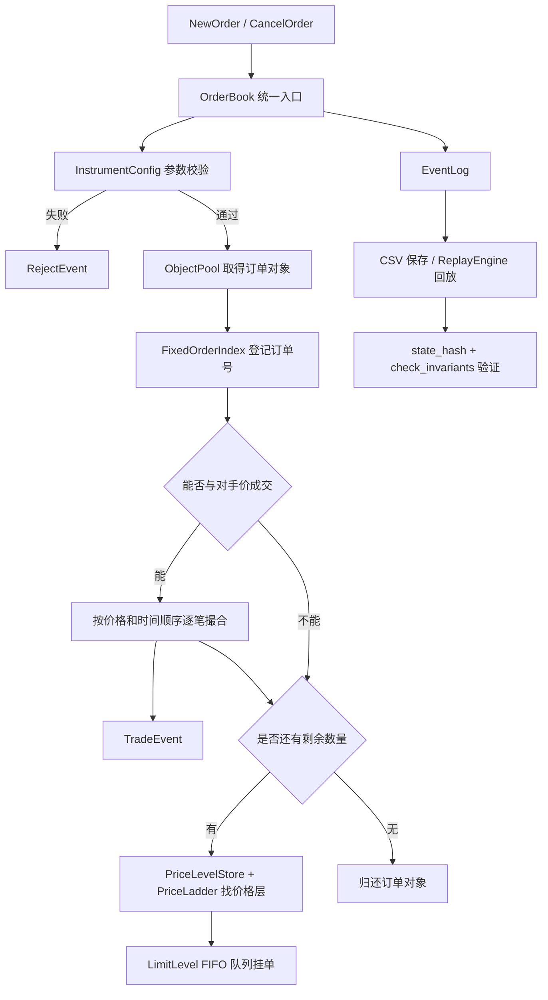

# 新项目完整介绍与使用说明

> 这份文档从零介绍当前项目。即使只懂少量金融术语，也可以先理解它解决的问题，再按照命令编译、运行和测试。文中“当前已支持”和“后续计划”严格分开。

## 1. 一句话介绍

这是一个使用 C++17 编写的单品种限价订单簿与撮合引擎：它接收买单、卖单和撤单，按照“价格优先、同价时间优先”的规则生成成交，并通过固定容量数据结构、事件回放和多层测试研究正确性、确定性与低延迟之间的平衡。

项目是在开源项目 [voyager-jhk/DeterministicMatchingEngine](https://github.com/voyager-jhk/DeterministicMatchingEngine) 基础上持续审查和重构得到的。原项目提供了基础思路，本项目保留来源和 MIT 许可证，并对构建、数据结构、异常路径、回放和性能验证进行了较大改造。

## 2. 它适合用来做什么

当前项目适合以下场景：

- 学习订单簿、挂单、吃单、部分成交和撤单；
- 学习量化开发常见的整数价格、对象池、固定索引和事件回放；
- 用历史命令驱动一个确定性的简化撮合环境；
- 比较不同 C++ 数据结构对中位数和尾部延迟的影响；
- 练习单元测试、随机属性测试、Sanitizer 和基准测试；
- 作为量化开发实习项目，展示“发现问题—改造—验证—承认边界”的完整过程。

当前项目**不应该直接用于**：

- 真实资金交易所或券商柜台；
- 直接接收网络订单并承担生产撮合；
- 账户资金、持仓、保证金和监管风控；
- 主备切换、跨机复制和灾难恢复；
- 将当前纳秒基准当成端到端交易延迟承诺。

## 3. 先理解四个最基本的词

### 3.1 限价单

限价买单表示“我最多愿意出多少钱”，限价卖单表示“我最低愿意卖多少钱”。

例如：

```text
买 100 股，限价 10.00：成交价格不能高于 10.00
卖 100 股，限价 10.00：成交价格不能低于 10.00
```

### 3.2 订单簿

暂时不能成交的订单会留下来排队，这个排队集合就是订单簿。它分为买方和卖方两边。

```text
卖方                         买方
10.03  100 股
10.02   80 股
10.01   50 股  ← 最优卖价
----------------------------
10.00   70 股  ← 最优买价
 9.99  120 股
 9.98   90 股
```

最优买价是买方愿意出的最高价，最优卖价是卖方愿意接受的最低价。

### 3.3 主动单和被动单

如果一笔新买单价格达到或高于当前最优卖价，它会立即与卖方成交。这笔新单是主动单，原来挂在簿里的卖单是被动单。成交价格使用被动订单所在价格层的价格。

### 3.4 价格优先、同价时间优先

- 更高的买价优先；
- 更低的卖价优先；
- 同一价格上，先到的订单排在前面。

当前项目用有序价格结构保证价格优先，用每个价格层的双向队列保证时间优先。

## 4. 总体架构



如果不熟悉图里的名称，可以把它理解为：

- `OrderBook` 是总调度员；
- `InstrumentConfig` 是交易规则表；
- `ObjectPool` 是预先准备的订单表格；
- `FixedOrderIndex` 是按订单号查人的通讯录；
- `PriceLevelStore` 是按价格排序的目录；
- `PriceLadder` 是常用价格区间的快速直达表；
- `LimitLevel` 是某一个价格上的排队队伍；
- `EventLog` 是操作流水；
- `ReplayEngine` 负责把流水重新执行并检查结果。

## 5. 项目文件结构

```text
.
├── CMakeLists.txt                         构建配置
├── README.md                              项目总入口
├── LICENSE                                MIT 许可证
├── src/
│   ├── types.hpp                          OrderId/Price/Quantity 等强类型
│   ├── instrument_config.hpp              tick、lot、价格和数量限制
│   ├── order.hpp                          Order、LimitLevel、订单对象池
│   ├── fixed_order_index.hpp              固定容量订单号索引
│   ├── limit_level_pool.hpp                共享价格层对象池
│   ├── price_level_store.hpp               有序价格层目录及池生命周期
│   ├── price_ladder.hpp                    常用价格区间 O(1) 层查找
│   ├── events.hpp                          接受、撤单、成交、拒绝事件
│   ├── orderbook.hpp                       主撮合、撤单、状态检查
│   ├── replay.hpp                          CSV 保存、读取和事件回放
│   └── main.cpp                            可运行演示
├── tests/
│   ├── unit_tests.cpp                     19 组固定场景测试
│   └── property_tests.cpp                 5 组属性/随机测试
├── benchmarks/
│   └── perf.cpp                           延迟和吞吐基准
└── docs/                                  分析、改造、路线和完整说明
```

## 6. 核心数据怎样表示

### 6.1 为什么不用 `double` 直接存价格

十进制小数在二进制浮点中不一定能精确表示。例如程序内部的 0.1 可能只是一个非常接近 0.1 的值。订单簿若直接比较浮点价格，可能在边界上产生意外。

项目将价格放大 10,000 倍后保存为整数：

```text
外部价格 100.00  -> 内部整数 1,000,000
外部价格 100.01  -> 内部整数 1,000,100
```

代码中的辅助函数：

```cpp
Price internal = from_double(100.01);
double display = to_double(internal);
```

对真实外部数据，更推荐在适配层直接解析十进制字符串为整数，不让浮点数进入引擎边界。`from_double()` 主要方便演示和测试。

### 6.2 为什么使用强类型

`OrderId`、`Price`、`Quantity`、`Timestamp` 底层都是整数，但它们是不同的 C++ 类型。这样可以减少把数量误传到价格位置、把时间误当订单号的错误。

```cpp
OrderId id(1001);
Price price = from_double(10.00);
Quantity quantity(100);
```

### 6.3 时间是什么意思

当前 `Timestamp` 是引擎内部递增的逻辑时间，不是操作系统纳秒时间。每接收命令或生成成交，逻辑时间按固定规则增加。

这样做的好处是同样输入可以得到同样事件顺序；限制是它不能直接代表真实世界的发送时间、接收时间或交易所时间。

## 7. 品种规则 `InstrumentConfig`

默认配置如下：

```cpp
InstrumentConfig config;
config.tick_size = 100;          // 内部 100 = 外部 0.01
config.lot_size = 1;             // 数量必须是 1 的整数倍
config.min_price = 1;
config.max_price = std::numeric_limits<int64_t>::max();
config.max_order_quantity = std::numeric_limits<uint64_t>::max();
```

自定义示例：价格只能在 1.00 到 1,000.00 之间，最小价格变化 0.01，数量必须是 100 的整数倍，单笔最多 100 万：

```cpp
InstrumentConfig config;
config.tick_size = 100;
config.lot_size = 100;
config.min_price = from_double(1.00).get();
config.max_price = from_double(1000.00).get();
config.max_order_quantity = 1'000'000;

OrderBook book(
    100'000,             // 最大活跃订单容量
    true,                // 是否记录事件
    PriceLadderConfig{}, // 常用价格快速表配置
    2,                   // 事件预留容量倍数
    config
);
```

当前会检查：

- 价格必须大于零；
- 价格必须位于允许范围；
- 价格必须落在 tick 网格；
- 数量必须大于零；
- 数量不能超过单笔上限；
- 数量必须是 lot 的整数倍；
- 订单号不能为零或重复；
- 订单对象和订单号索引必须还有容量。

## 8. 订单、对象池和同价队列

### 8.1 `Order`

每个订单保存订单号、到达逻辑时间、买卖方向、限价、原始数量、剩余数量，以及前后订单和所属价格层指针。

所属层指针是撤单优化的重要部分。通过订单号找到订单后，可以直接把它从所属队列摘除，不必再从价格目录查一次。

### 8.2 `ObjectPool<Order>`

项目启动时按容量准备订单对象。新订单从池中取对象，完全成交或撤销后归还。

优势：

- 正常热路径不需要为每笔订单单独 `new`；
- 地址稳定，适合链表和索引保存指针；
- 内存上限较清楚；
- 订单池满时可以明确拒绝。

代价：

- 启动时就要占用相应内存；
- 容量需要提前规划；
- 对象生命周期必须严格检查。

### 8.3 `LimitLevel`

同一个价格上的订单通过侵入式双向链表排队：

```text
head                                       tail
订单 101 ⇄ 订单 108 ⇄ 订单 115 ⇄ 订单 120
最早                                         最晚
```

新单加到尾部，撮合从头部开始，因此天然遵守同价时间优先。已知订单地址时，可以在 O(1) 链表操作中撤销队中订单。

### 8.4 `LimitLevelPool`

买卖双方共享一个固定容量价格层池。新价格第一次出现时取得价格层，最后一笔订单离开该层时归还。

价格层总数不会超过活跃订单数，所以当前让层池与订单池使用相同容量。正常逻辑下，有一笔剩余订单需要挂单时必然还有相应层容量；如果这个不变量被破坏，代码选择终止而不是继续产生损坏状态。

## 9. 订单号索引 `FixedOrderIndex`

撤单首先要通过订单号找到订单。当前版本不再用可动态扩容的 `unordered_map`，而是使用固定容量开放寻址索引。

工作方式可以简单理解为：

1. 根据订单号计算一个起始槽位；
2. 如果被占用，就按固定规则寻找下一个槽位；
3. 查找时走相同路线；
4. 删除后把后方仍依赖这条查找路线的项目向前修复。

删除采用后移修复，而不是永久留下“这里以前有东西”的墓碑。这样高频撤单运行很久后，不会因为墓碑越来越多而明显退化。

注意：平均 O(1) 不代表严格只访问一次内存。散列冲突时仍需探测多个槽位，所以容量规划和装载率仍然重要。

## 10. 价格层目录和快速价格梯

当前价格访问是一个混合结构。

### 10.1 `PriceLevelStore`

买卖双方各使用一个按价格排序的 `std::map`：

- 买方从高到低，因此第一项是最高买价；
- 卖方从低到高，因此第一项是最低卖价；
- 每个 map 值不是直接保存层对象，而是指向层池里的 `LimitLevel`。

它负责完整价格排序和范围外价格，是当前找最优价和跨档扫描的权威目录。

### 10.2 `PriceLadder`

配置范围内的价格会按 tick 映射到连续指针数组。已知一个常用价格时，可以直接计算数组位置找到价格层，不必再次走树查找。

默认快速范围为：

```cpp
PriceLadderConfig {
    min_price = 900000,   // 90.00
    max_price = 2100000,  // 210.00
    tick = 100            // 0.01
};
```

范围外订单仍由 `std::map` 正确处理，因此这不是“价格只能在 90 到 210”。它只是常用区间的快速查找缓存。

### 10.3 当前混合结构的真实边界

`PriceLadder` 已经让范围内的“按已知价格找层”达到数组定位，但最佳价格排序和价格层成员关系仍由 `std::map` 维护。因此新价格出现和空价格消失时，map 树节点仍可能分配或释放。

后续优化重点不是再加一个同样的数组，而是让稠密结构能够快速维护“哪些价格档活跃”和“下一个最优档在哪里”，从而让常用范围内逐步绕开 map 节点。

## 11. 一笔新订单的完整流程

以一笔买单为例：

### 第一步：逻辑时间前进

引擎给这条命令一个确定的先后位置。

### 第二步：校验

检查订单号、价格、tick、数量、lot 和限制。失败则生成 `RejectOrderEvent` 并返回。

### 第三步：预留订单对象和索引位置

从订单池取得对象，并先把订单号写入固定索引。只有这两项基础资源成功后，才生成 `NewOrderEvent`，避免订单池或索引已满时日志仍说接受。

当前仍有一个需要继续改进的异常边界：如果剩余订单需要建立新价格，`std::map` 树节点分配理论上仍可能抛出系统内存异常。项目尚未为这种不可预见分配失败实现完整事务回滚，因此不能把当前实现描述成“所有失败都绝对不会产生半状态”。正常的固定容量失败已被处理，系统分配异常会在后续原子性改造中解决。

### 第四步：检查卖方最优价

若新买价低于最低卖价，不能成交；若新买价达到或高于最低卖价，就从该卖价最早订单开始成交。

### 第五步：逐笔扣减数量

成交数量为主动单剩余量和被动单剩余量中的较小值：

```text
trade_qty = min(主动单剩余, 被动单剩余)
```

每次成交生成 `TradeEvent`。被动单完全成交后，从队列、订单号索引和对象池中移除，然后继续看下一笔或下一价格层。

### 第六步：处理主动单剩余

- 如果主动单完全成交，移除索引并归还对象；
- 如果还有剩余，找到或创建自己的买方价格层，并加入队尾。

卖单过程完全对称，只是它从最高买价开始向下成交。

## 12. 一个跨档成交例子

原订单簿卖方为：

```text
100.00：20 股（订单 3）
100.50：30 股（订单 2）
101.00：50 股（订单 1）
```

现在来一笔“101.50 买 80 股”的订单 6：

1. 先以 100.00 成交 20 股，剩余 60；
2. 再以 100.50 成交 30 股，剩余 30；
3. 再以 101.00 成交 30 股，订单 6 完全成交；
4. 101.00 原卖单还剩 20 股；
5. 新最优卖价为 101.00。

这就是演示程序中的“跨多个价格层扫单”。成交价取每一档被动挂单价格，而不是统一使用新买单的 101.50。

## 13. 撤单流程

```text
撤单命令
  ↓
记录 CancelOrderEvent
  ↓
FixedOrderIndex 查订单号
  ├── 找不到：记录 ORDER_NOT_FOUND 拒绝
  └── 找到：通过 parent_level 直接摘链
              ↓
          更新层数量和订单数
              ↓
          空层则从价格目录删除并归还层池
              ↓
          删除订单索引并归还订单对象
```

当前撤单事件表示“系统收到撤单命令”。因此找不到订单时，会同时出现一条撤单命令事件和一条 `ORDER_NOT_FOUND` 拒绝结果。这种记录方式有利于保存完整命令序列。

## 14. 事件系统

当前事件使用 `std::variant` 保存不同结构，避免虚函数层次。支持四类实际事件：

| 事件 | 含义 |
|---|---|
| `NewOrderEvent` | 一笔新订单通过基础资源检查并被接受 |
| `CancelOrderEvent` | 收到撤单命令 |
| `TradeEvent` | 主动订单和被动订单发生一笔成交 |
| `RejectOrderEvent` | 命令因为明确原因未成功 |

当前拒绝原因包括：

- `DUPLICATE_ORDER_ID`：订单号为零或重复；
- `INVALID_PRICE`：价格小于等于零；
- `INVALID_QUANTITY`：数量为零；
- `POOL_EXHAUSTED`：订单池已满；
- `INDEX_EXHAUSTED`：订单号索引无法插入；
- `ORDER_NOT_FOUND`：撤单找不到目标；
- `PRICE_OUT_OF_RANGE`：价格超出品种范围；
- `OFF_TICK_PRICE`：价格不符合最小变动；
- `QUANTITY_LIMIT`：数量超过单笔上限；
- `INVALID_LOT_SIZE`：数量不符合最小交易单位。

事件日志使用连续的 `std::vector<Event>`，构造订单簿时会按容量倍数预留空间。它减少了常见情况下的扩容，但不是固定上限环形队列；超出预留容量后仍可能扩容，这是路线图中明确保留的问题。

## 15. 保存和回放

### 15.1 保存 CSV

```cpp
const auto& events = book.get_event_log();
ReplayEngine::save_log(events, "matching_engine.log");
```

示例内容：

```csv
NEW_ORDER,1,1,SELL,1010000,50
NEW_ORDER,2,2,BUY,1010000,20
TRADE,3,1,2,1010000,20
CANCEL_ORDER,4,1
```

价格保存的是内部整数，避免输出和再次解析小数时产生差异。

### 15.2 读取文件

```cpp
std::vector<Event> log = ReplayEngine::load_log("matching_engine.log");
```

解析器会严格检查：

- 事件名称是否认识；
- 字段数量是否正确；
- 整数字段是否包含非法字符或越界；
- 买卖方向是否为 `BUY`/`SELL`；
- 拒绝原因是否在已知列表中。

### 15.3 重建订单簿

```cpp
OrderBook replayed = ReplayEngine::replay_from_log(
    log,
    config,
    PriceLadderConfig{}
);
```

回放重新注入新单和撤单。`TradeEvent` 是这些命令的结果，不会再次作为命令执行；拒绝事件用于保持逻辑时间。调用者必须传入与原运行相同的 `InstrumentConfig` 和价格梯配置。

### 15.4 当前回放的边界

- CSV 没有版本号和校验和；
- 写文件不是崩溃安全协议；
- 配置没有随文件自动保存；
- 回放容量根据日志大小估算；
- 当前更适合测试、教学和离线实验，不是生产恢复系统。

## 16. 怎样证明状态一致

### 16.1 `state_hash()`

状态哈希会按稳定顺序混合：

- 当前逻辑时间；
- 买方和卖方标记；
- 每个价格；
- 每个活跃订单的订单号；
- 原始到达逻辑时间；
- 剩余数量；
- 同价队列位置。

同样命令回放后，如果哈希一致，说明完整可见订单顺序和逻辑时间一致的可信度远高于只比较最优买卖价。

哈希不是密码学证明，也不能代替全部测试；它是快速比较两个状态的工程工具。

### 16.2 `check_invariants()`

这个函数会遍历整个订单簿，检查链表、汇总数量、索引、对象池、价格层池、稠密价格梯和缓存指针互相一致。

```cpp
if (!book.check_invariants()) {
    throw std::runtime_error("order book invariant broken");
}
```

它是较重的诊断操作，适合测试、恢复后审计和低频健康检查，不应放在每一笔低延迟订单路径中。

## 17. 快速开始：Windows + Visual Studio 2022

### 17.1 环境

- Windows 10/11；
- Visual Studio 2022；
- 安装“使用 C++ 的桌面开发”；
- CMake 3.14 或更高版本；
- Git。

### 17.2 生成和编译

在项目根目录打开 **Developer PowerShell for VS 2022**，或先确保 `cmake` 已加入 `PATH`：

```powershell
cmake -S . -B build -G "Visual Studio 17 2022" -A x64
cmake --build build --config Release
```

### 17.3 运行演示

```powershell
.\build\Release\matching_engine_demo.exe
```

演示会：

1. 建立三档卖单和两档买单；
2. 提交一笔跨多档主动买单；
3. 撤销一笔买单；
4. 打印最近事件；
5. 保存 `matching_engine.log`；
6. 从内存事件回放并比较最优价格。

### 17.4 运行全部 CTest

```powershell
ctest --test-dir build -C Release --output-on-failure
```

也可以分别运行：

```powershell
.\build\Release\matching_engine_unit_tests.exe
.\build\Release\matching_engine_property_tests.exe
.\build\Release\matching_engine_benchmarks.exe
```

## 18. 快速开始：Linux / WSL

```bash
cmake -S . -B build -DCMAKE_BUILD_TYPE=Release
cmake --build build -j
ctest --test-dir build --output-on-failure
./build/matching_engine_demo
./build/matching_engine_benchmarks
```

GCC/Clang 的 Release 配置包含 `-O3 -DNDEBUG -march=native`。这意味着生成程序会针对当前 CPU 优化；把可执行文件复制到更老的 CPU 上不一定能够运行。

## 19. 内存安全测试

### 19.1 MSVC AddressSanitizer

```powershell
cmake -S . -B build-asan -G "Visual Studio 17 2022" -A x64 -DENABLE_ASAN=ON
cmake --build build-asan --config Debug
.\build-asan\Debug\matching_engine_unit_tests.exe
.\build-asan\Debug\matching_engine_property_tests.exe
```

### 19.2 GCC/Clang ASan + UBSan

```bash
cmake -S . -B build-sanitize \
  -DCMAKE_BUILD_TYPE=Debug \
  -DENABLE_ASAN=ON \
  -DENABLE_UBSAN=ON
cmake --build build-sanitize -j
ctest --test-dir build-sanitize --output-on-failure
```

Sanitizer 版本用于查内存和未定义行为，不用于性能测试，因为它会插入额外检查，速度不代表 Release 版本。

## 20. 当前测试覆盖

### 20.1 19 组单元测试

固定场景包括：

- 简单完全成交；
- 部分成交；
- 跨多个价格层成交；
- 撤单；
- 价格时间优先；
- 全量不变量检查；
- 回放确定性；
- 空订单簿；
- 穿价订单；
- 非法输入拒绝；
- 重复订单号拒绝；
- 订单池耗尽的确定行为；
- 快速价格梯范围外回退；
- 高频撤销和对象复用；
- 事件预留容量配置；
- 价格层池生命周期；
- tick/lot 等品种规则；
- 磁盘日志往返；
- 损坏日志拒绝。

### 20.2 5 组属性测试

属性测试不只固定几笔订单，而是生成大量操作，验证始终应该成立的规则：

- 订单簿结束后不会保留可立即互相成交的买卖价；
- 相同事件回放结果一致；
- 数量守恒；
- 同价 FIFO 顺序；
- 成交价格方向满足单调规则。

### 20.3 为什么两种测试都要有

固定场景容易定位错误，随机属性测试容易发现作者没有想到的组合。两者加上 `check_invariants()` 和 Sanitizer，才形成比较可靠的安全网。

## 21. 怎样正确看性能数字

当前项目不是只输出一个“平均延迟”，而是区分：

- 核心下单微基准；
- 已存在订单的撤单；
- 价格层反复创建和清空；
- 完整路径分位数；
- 百万操作长时间吞吐。

当前本机 Release 代表性结果：

| 场景 | 代表范围 |
|---|---:|
| 核心批量下单多轮中位数 | 约 40–50 ns/单；本轮 41.597 ns |
| 单轮批量范围 | 本轮约 38.662–51.169 ns/单 |
| 撤单核心路径 | 约 18–30 ns/单 |
| 价格层 churn | 多轮约 66–86 ns/次；本轮 85.78 ns |
| 百万订单混合压力 | 约 640–680 万操作/秒 |
| 完整路径 P99 | 数百 ns |
| 完整路径 P99.9 | 约 1–3 μs |

这些结果不包含网络、外部协议解析、账户风控、磁盘同步和跨机复制。核心路径还可能关闭事件、批量预热，因此不能把 40–50 ns 写成“客户下单到交易所成交”的延迟。

本轮 Windows 逐笔计时的 P50 显示过 `0 ns`。这不是操作没有成本，而是单次时间短于当前计时器的可见粒度。项目因此把 100,000 笔一批、重复 7 轮的批量平均作为核心路径主要参考；逐笔测试主要用于观察 P99、P99.9 和最大值。

## 22. 怎样复现和记录基准

Windows：

```powershell
cmake --build build --config Release
.\build\Release\matching_engine_benchmarks.exe
```

Linux：

```bash
cmake --build build -j
./build/matching_engine_benchmarks
```

记录结果时至少保存：

- CPU 型号；
- 操作系统；
- 编译器和版本；
- Debug/Release；
- 编译参数；
- 测试轮数和样本量；
- 是否记录事件；
- 价格与成交分布；
- 中位数、P99、P99.9，而不只是最低值。

几十纳秒级测试会受后台程序、CPU 频率和线程迁移影响，所以多轮范围通常比单次结果更可信。

## 23. 最小代码示例

```cpp
#include "orderbook.hpp"
#include <iostream>

int main() {
    InstrumentConfig config;
    config.tick_size = 100; // 0.01
    config.lot_size = 1;

    OrderBook book(
        10'000,              // 最大活跃订单数
        true,                // 记录事件
        PriceLadderConfig{}, // 快速价格范围
        2,                   // 预留约 capacity * 2 个事件
        config
    );

    book.process_new_order(
        OrderId(1), Side::SELL, from_double(10.00), Quantity(100));

    book.process_new_order(
        OrderId(2), Side::BUY, from_double(10.00), Quantity(40));

    // 卖单 1 还剩 60，最优卖价仍为 10.00
    if (auto ask = book.best_ask()) {
        std::cout << "best ask = " << to_double(*ask) << '\n';
    }

    book.process_cancel(OrderId(1));

    if (!book.check_invariants()) {
        return 1;
    }
    return 0;
}
```

## 24. 容量应该怎样选择

构造函数的 `capacity` 表示最大活跃订单对象容量，并同时用于固定订单号索引和共享价格层池的规划。

不要直接把容量设成历史平均订单数。更稳妥的做法是：

1. 用历史高峰数据统计最大同时挂单数；
2. 考虑测试数据是否包含极端撤单/挂单堆积；
3. 留出明确安全余量；
4. 观察可用订单槽和价格层槽高水位；
5. 容量满时把拒绝当成可见结果，不要临时扩容掩盖规划错误。

容量越大，启动内存越高。项目目前没有提供精确的“每订单总内存”常量，因为总成本还包括索引槽、事件预留、价格梯和 `std::map` 节点，不能只看 `sizeof(Order)`。

## 25. 常见问题

### Q1：这个项目达到稳定 30 ns 了吗？

没有。当前特定预热微基准多轮中位数约 40–50 ns，本轮为 41.597 ns，个别单轮可以略低于 40 ns。30 ns 仍然是继续研究数据结构和硬件环境的目标，不是完整路径承诺。

### Q2：为什么还保留 `std::map`？

它使价格排序正确、代码清楚，并能覆盖任意合法价格。当前已经用快速价格梯加速已知常用价格查层，但最优价维护仍依赖 map。下一步会在真实价格分布数据支持下，让活跃价格带更多绕开 map，而不是盲目换结构。

### Q3：对象池是不是等于完全没有动态分配？

不是。订单对象和价格层对象预先分配，订单号索引也固定容量；但事件 `vector` 超出预留会扩容，`std::map` 树节点仍会分配。文档明确保留这些限制。

### Q4：为什么用单线程？

同一个订单簿需要严格决定先后顺序。单写者模型更容易保证确定性，也避免热路径锁竞争。未来多品种可以按品种分片到不同线程，而不是让多个线程同时争抢一个簿。

### Q5：回放为什么不再次执行 `TradeEvent`？

成交是新单与已有订单共同产生的结果。重新执行同样的新单和撤单，自然应该重新产生同样成交；如果再把成交事件执行一次，就会重复扣减数量。

### Q6：状态哈希相同就百分之百正确吗？

不能这样说。哈希碰撞理论上存在，而且两个实现也可能以相同方式出错。因此还需要固定测试、属性测试、不变量检查和参考模型。哈希主要用于快速比较回放状态。

### Q7：它能直接做策略回测吗？

可以作为回测中的撮合核心原型，但还需要外层适配历史行情、策略订单时间、手续费、滑点、交易时段和多品种配置。当前项目没有假装这些都已经完成。

## 26. 如果我在面试中介绍这个项目

我会这样概括：

> 我从一个开源的确定性撮合引擎原型开始，没有直接照搬它的 30 ns 宣传，而是先在 Visual Studio 和 Linux 环境实际编译、测试和压测。我发现原实现存在运行时容器扩容、价格层仍分配、回放闭环不完整、输入拒绝原因不清和基准口径混合等问题。之后我用固定容量开放寻址索引替代订单号 `unordered_map`，让订单直接保存所属价格层以优化撤单，把共享价格层池接入主路径，增加了品种 tick/lot 配置、严格 CSV 回放、状态哈希、全量不变量检查、19 组单元测试、5 组属性测试和 Sanitizer。当前特定核心微基准多轮中位数约 40–50 ns，但完整路径尾延迟更高，我会明确区分这些口径。下一步重点是版本化持久化恢复和进一步绕开 `std::map` 节点，而不是只追求一个最好看的数字。

这个介绍的重点不是背诵专业词，而是说明我做过完整的工程判断：知道哪里快、为什么快、哪里仍然会慢，以及怎样证明改动没有破坏交易规则。

## 27. 文档阅读顺序

如果想进一步了解来源和改造过程，建议按下面顺序阅读：

1. [原项目框架与问题分析](01-原项目框架与问题分析.md)
2. [从原项目到当前版本的改造报告](02-从原项目到当前版本的改造报告.md)
3. 本文：当前项目完整结构和使用方法
4. [当前项目的后续改进路线](03-当前项目的后续改进路线.md)

## 28. 许可证和致谢

本项目沿用 MIT License。原始设计和基础代码来自 [voyager-jhk/DeterministicMatchingEngine](https://github.com/voyager-jhk/DeterministicMatchingEngine)，感谢原作者提供可继续研究的开源起点。

当前仓库中的跨平台构建、固定订单索引、撤单直达、共享价格层池、品种规则、回放校验、内部审计、测试体系、基准拆分和文档重写，是在该基础上继续完成的工程改造。
